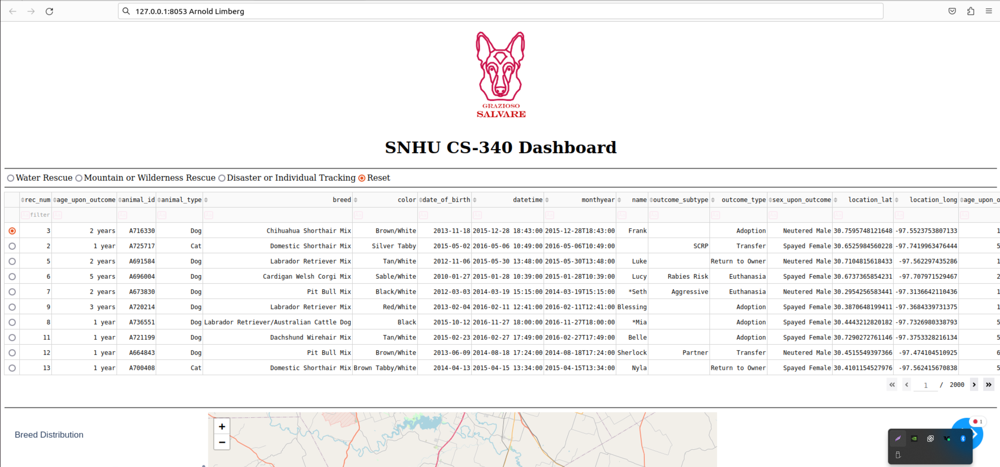

## Writing Maintainable, Readable, and Adaptable Programs

Some best practices to adhere to while writing legible, flexible, and maintainable programs are as follows:

1. **Meaningful and Consistent Naming**: Use meaningful and consistent names for variables, functions, and classes. This makes it easier to quickly comprehend the function of each part.

2. **Modular Code**: Divide the application into more manageable, reusable sections using modular code. This improves readability and facilitates the maintenance and updating of individual code segments without compromising the system as a whole.

3. **Comments and Documentation**: Provide documentation for functions and classes, as well as comments explaining intricate reasoning. Anyone who works on the code in the future needs to know this.

4. **Respect Code Standards**: Adhere to accepted code conventions. This includes arranging imports, using spaces properly, and indenting text correctly.

5. **Unit Tests**: Ensure code works properly. This ensures that new changes don't interfere with already-existing functionality and aids in the early identification of concerns.

### Python CRUD Module

Project One's CRUD Python module serves as an example of these ideas. Its modular and reusable design allowed it to manage Create, Read, Update, and Delete actions for the MongoDB database. This module then made it easy to connect the dashboard widgets and database in Project Two.

**Benefits of this strategy**:

- **Reusability**: You can use the CRUD module again, unchanged, in a variety of projects.
- **Maintainability**: Because only the CRUD module requires modifications to database interactions, maintenance is considerably easier.
- **Readability**: The module abstracts away database operations, making the dashboard's code clearer and more focused on the presentation logic.

**Future use**: You can expand or modify this CRUD module to handle various collections or databases, making it a flexible tool for any project requiring database interactions.

## A Computer Scientist's Approach to Problem-Solving

A computer scientist approaches an issue by taking many crucial steps:

1. **Comprehend Requirements**: Understand the issue in detail and gather all relevant requirements. This necessitates assessing the paperwork and communicating with stakeholders.

2. **Creating a Solution**: Arrange the solution's architecture and design. This entails selecting the user interface design, database structure, and technologies for use.

3. **Develop the Solution**: Develop the solution piece by piece, testing each component as you go. This facilitates the early detection and resolution of problems during the development process.

4. **Iteration and Feedback**: To make the solution better, keep getting input and improving it.

The Grazioso Salvare project used this methodology to develop the database and dashboard. This project, in contrast to earlier assignments, called for the smooth integration of several components (database, backend, and frontend). We managed this complexity by using Dash for the dashboard and a CRUD module.

## Upcoming Methods and Approaches

The following methods and approaches would be useful for upcoming projects:

- **Frameworks**: Using backend frameworks such as Flask or Django helps streamline development and offers pre-built functionalities for frequent activities.
- **Automated Testing**: Implementing automated tests to ensure the codebase's dependability.
- **CI/CD Pipelines**: Automating testing and deployment procedures with CI/CD pipelines is known as continuous integration/continuous deployment, or CI/CD.

## Computer Scientists' Role

When it comes to creating and sustaining software solutions that address real-world issues, computer scientists are essential. Their efforts are important because

- **Increases Productivity**: Task automation and workflow-optimizing tool provision.
- **Improves Decision Making**: Creating systems that use data analysis and visualization to offer insightful information.
- **Facilitating Innovation**: The process of developing new tools and methods that advance a variety of industries.

Within Grazioso Salvare, the dashboard project facilitates more effective dog identification and classification for rescue training. Thus, the business is able to concentrate on raising and training rescue dogs, which eventually results in the saving of more lives. The project's abilities and approaches are transferable to other situations, showcasing the impact and diversity of computer science work.
